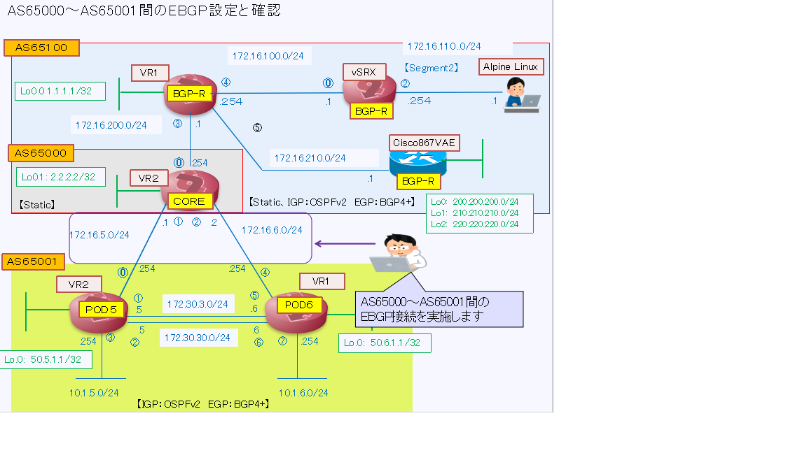
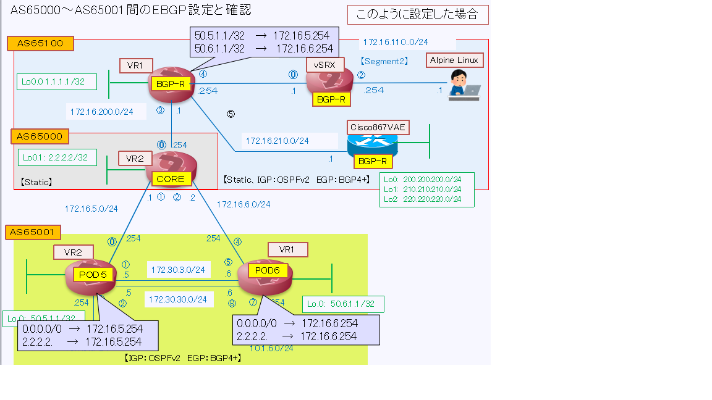
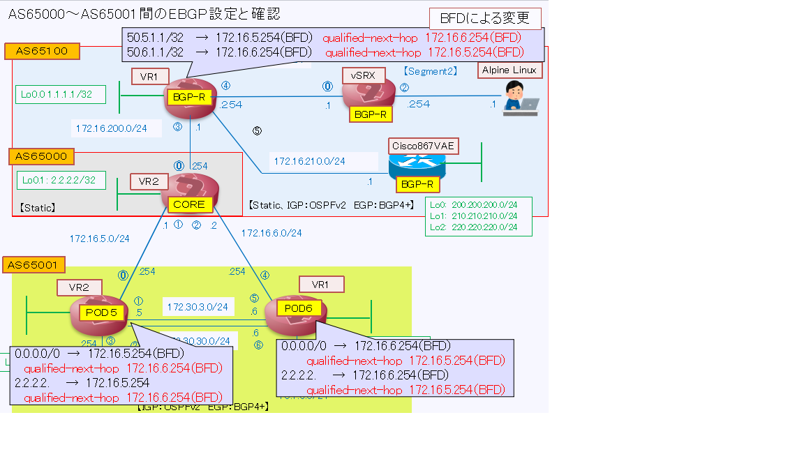

[目次に戻る](./Junos-BGP-exercises.md)  

# EBGPによるネットワーク演習

## EBGP接続(Juniper間の設定） 
今回は以下の条件で設定します。 

１　通常EBGP接続に場合は対向ASの物理インターフェスアドレスをピアアドレスとして 
　　設定しますが、今回は対向ASルータのループバックアドレスをピアーアドレスとして 
　　設定します。 

２　AS間のStaticルートを冗長化するために以下の設定を実施します 
　（AS65000：CORE、AS65001：VR1/VR2） 
　　　BFDを用いたStaticルートを設定する 
   　　→　これによりAS65001向けの回線がDOWNした場合でも別の回線を 
   　　　　使用して迂回することが可能 

　（AS65001：VR1/VR2） 
　　　IGP(OSPF)においてお互いにデフォルトルートを通知する設定を実施 
   　　→　各ルータのAS65000向け回線がDOWNした場合でも別のルータの回線 
   　　　を使用して迂回することが可能 

**【EBGP間の接続(AS65000～AS65001）】** 
   
  
  
  
  今回、AS間の接続についてはStaticルートを使用しますが、BFDを活用して
   回線障害時に切替ができるようにします 
   
   #### BFDとは？ 
   BFD（Bidirectional Forwarding Detection）は 
   2台の隣接するルータ間の転送パスの生存状況を調べて高速に障害を検知してルーティングプロトコルに通知する機能です 
   BFD機能は、隣接するルータとの間にL2スイッチなどが存在し、リンクステータスが伝わらない障害が発生した場合に効果的な機能 
   
   **(参考：）BFD がネットワーク障害を検出する方法の理解 Juniper networks** 
   https://www.juniper.net/documentation/jp/ja/software/junos/high-availability/topics/topic-map/bfd.html 
   
   
 **【現状の課題】** 
   
  
   
  
 **【BFDを使用した構成】** 
  
 
 ### BFDの設定例 
 **【AS65000(CORE)での設定】** 

 AS65001配下のサブネット(50.5.1.1/32、50.6.1.1/32）に対するStatic経路をBFDで記述 

set routing-instances VR2 routing-options static route 1.1.1.1/32 next-hop 172.16.200.1 

set routing-instances VR2 routing-options static route 50.5.1.1/32 next-hop 172.16.5.254 
set routing-instances VR2 routing-options static route 50.5.1.1/32 qualified-next-hop 172.16.6.254 
preference 10 
set routing-instances VR2 routing-options static route 50.5.1.1/32 qualified-next-hop 172.16.6.254
bfd-liveness-detection minimum-interval 60 
set routing-instances VR2 routing-options static route 50.5.1.1/32 bfd-liveness-detection 
minimum-interval 60 

set routing-instances VR2 routing-options static route 50.6.1.1/32 next-hop 172.16.6.254 
set routing-instances VR2 routing-options static route 50.6.1.1/32 qualified-next-hop 172.16.5.254 
bfd-liveness-detection minimum-interval 60 
set routing-instances VR2 routing-options static route 50.6.1.1/32 bfd-liveness-detection 
minimum-interval 60 

