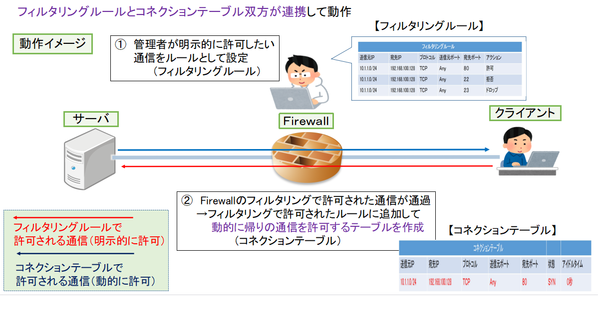
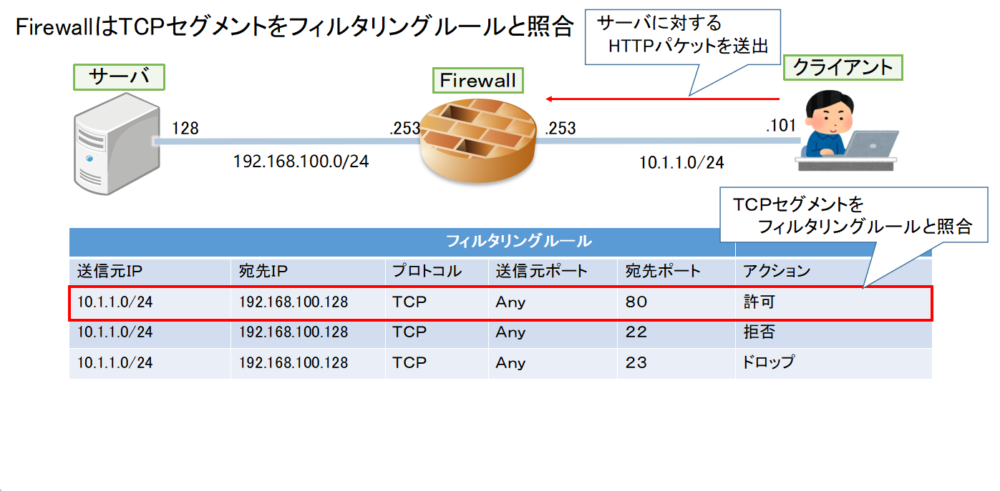
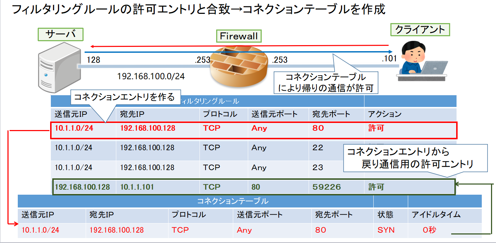

# Firewallの概要
[元に戻る](./JunosSRX-Firewall-Basic.md)  

## Firewallとは
ファイアウォール（英: Firewall）は、コンピュータネットワークにおいて、ネットワークの結節、コンピュータセキュリティの保護、その他の目的のため、通過させてはいけない通信を阻止するシステムを指す。  

https://ja.wikipedia.org/wiki/%E3%83%95%E3%82%A1%E3%82%A4%E3%82%A2%E3%82%A6%E3%82%A9%E3%83%BC%E3%83%AB

## Firewallによるフィルタリング方式
Firewallにおけるフィルタリング方式は以下の３つに分類されます  
１　パケットフィルタリング型（ステートレス）  
　　パケットのヘッタ情報に含まれるIPアドレス、ポート番号に基づいてフィルタリングを行う方式  
  
２　ステートレスインスペクション型（ステートフル） 
　　セッション（通信の開始から終了まで管理する単位）の状態を管理して、常にその情報に基づいてフィルタリングを行う。 

３　アプリケーションレベルゲートウェイ型 
　　プロトコルごとにプロキシ（中継専用プログラム）を持ち、パケットのアプリケーション層も含めた情報に基づいてフィルタリングを行う方式 

## ステートフルインスペクション型Firewallの動作
フィルタリングルールとコネクションテーブル（セッションテーブル）双方が連携して動作 

フィルタリングルール（管理者が作成）  
どんな通信を許可し、どんな通信を拒否するかを定義する  
　設定項目： 
 　送信元IPアドレス、宛先IPアドレス、プロトコル、送信元ポート番号、通信制御（許可/拒否）　などがあります  

 コネクションテーブル（セッションテーブル）（Firewallを通過する通信により動的に作成）  
　Firewallを経由するセッション（コネクション）の情報を管理しているテーブル  
　テーブルの内容： 
 　送信元IPアドレス、宛先IPアドレス、プロトコル、送信元ポート番号、宛先ポート番号、コネクションの状態（、アイドルタイムアウト　などがあります  

  

  　**【ステートフルインスペクション形Firewallのイメージ】** 
  
   

　**【ステートフルインスペクション形Firewallの動作(その１）】** 
　 

 **【ステートフルインスペクション形Firewallの動作(その２）】** 
　 

  **【ステートフルインスペクション形Firewallの動作(その３）】** 
　 
 

 Juniper SRXのステートフルインスペクション形Firewallの動作については 
 　こちらで紹介します

 　　　　　　　　　　
